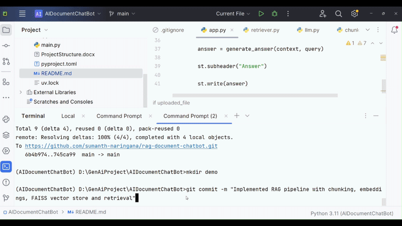

# AI Document Chatbot (RAG)

A Retrieval-Augmented Generation (RAG) based chatbot that allows users to upload PDF documents and ask questions about them.
The system retrieves relevant sections from the document and uses a Large Language Model (LLM) to generate answers.

---

## 🎥 Demo

A short demo video showing how the chatbot works.


---

## 🚀 Features

* Upload PDF documents
* Extract and process document text
* Intelligent text chunking
* Semantic embeddings generation
* Fast similarity search using FAISS
* Retrieval-Augmented Generation (RAG)
* Interactive chat interface using Streamlit

---

## 🧠 How It Works

The system follows the **Retrieval-Augmented Generation architecture**:

1. User uploads a PDF document
2. Text is extracted from the PDF
3. The text is split into smaller chunks
4. Embeddings are generated for each chunk
5. Embeddings are stored in a FAISS vector database
6. User asks a question
7. The system retrieves the most relevant document chunks
8. The LLM generates an answer using the retrieved context

---

## 🏗 Project Structure

```
rag-document-chatbot
│
├── app
│   └── app.py
│
├── rag
│   ├── loader.py
│   ├── chunker.py
│   ├── vector_store.py
│   ├── retriever.py
│   └── llm.py
│
├── data
│   └── documents
│
├── pyproject.toml
├── uv.lock
└── README.md
```

---

## ⚙️ Installation

Clone the repository:

```
git clone https://github.com/sumanth-naringana/rag-document-chatbot.git
cd rag-document-chatbot
```

Create virtual environment:

```
uv venv
```

Activate environment (Windows):

```
.venv\Scripts\activate
```

Install dependencies:

```
uv sync
```

---
## 🤖 Local LLM Setup

This project uses a locally running Large Language Model through **Ollama**.

### Install Ollama

Install Ollama using Windows package manager:

```
winget install Ollama.Ollama
```

Verify installation:

```
ollama --version
```

### Download the LLM Model

Download the Llama model required for the chatbot:

```
ollama pull llama3
```

Check available models:

```
ollama list
```

Example output:

```
NAME        SIZE
llama3      ~4.7GB
```

### Test the Model

Run the model locally:

```
ollama run llama3
```

If the model responds, Ollama is correctly installed.

The chatbot will use this locally running model to generate answers.

---
## ▶️ Run the Application

Start the Streamlit app:

```
python -m streamlit run app/app.py
```

Then open:

```
http://localhost:8501
```

Upload a PDF and start asking questions.

---

## 🛠 Tech Stack

* Python
* Streamlit
* LangChain
* FAISS
* Sentence Transformers
* Retrieval-Augmented Generation (RAG)

---

## 📚 Concepts Demonstrated

* Retrieval-Augmented Generation
* Semantic Search
* Vector Databases
* LLM Integration
* Document Question Answering

---

## 👨‍💻 Author

**Sumanth M**

---

## 🎯 Future Improvements

* Persistent FAISS index
* Multi-document support
* Chat memory
* Source citations
* Faster retrieval pipeline
